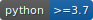

# Synthetic Data Generator
    

- [Synthetic Data Generator](#synthetic-data-generator)
  * [1. Description](#1-description)
  * [2. Install](#2-install)
  * [3. Usage](#3-usage)
    + [3.1 Metadata Types](#31-metadata-types)
      - [3.1.1 YAML Metadata](#311-yaml-metadata)
      - [3.1.2 JSON Metadata](#312-json-metadata)
      - [3.1.3 Metadata object](#313-metadata-object)
      - [3.1.4 Dictionary](#314-dictionary)
  * [4. Generating Data](#4-generating-data)
  * [5. Writing Data](#5-writing-data)
    + [5.1 Writing data locally](#51-writing-data-locally)
    + [5.2 Writing data locally in batches](#52-writing-data-locally-in-batches)
    + [5.3 Writing data to AWS S3](#53-writing-data-to-aws-s3)
    + [5.4 File types](#54-file-types)
    + [5.5 Desired size](#55-desired-size)
    + [5.6 Samples](#56-samples)
  * [6. Seeding and relational datasets](#6-seeding-and-relational-datasets)
  * [7. Testing](#7-testing)
    + [7.1 Unit Testing](#71-unit-testing)
    + [7.2 Performance Testing](#72-performance-testing)
  * [8 Performance Improvements Tips](#8-performance-improvements-tips)

## 1. Description
This package has been designed to generate large quantities of data using Faker in CSV or JSON formats.    
It supports all the providers from Faker (like Address or phone number) and all the basic data types (string, integer, etc.)

## 2. Install
```shell
pip3 install synthetic-data-generator
```

## 3. Usage

```python
from sdg import SDG
```


### 3.1 Metadata Types
To generate a dataset, metadata is required for the package to know what data types to generate.    
Below are a few examples on the types of metadata and how they can be used to generate fake data.

#### 3.1.1 YAML Metadata
The synthetic generator will take as input the metadata and will convert it into a Metadata object which will then
be used to create the dataset. Each of the columns must contain the "name" and "type" and the rest are optional. 

```yaml
---
format: csv
file_name: test-file-name
separator: ',' # Optional
seed: 50 # Optional (default None)
columns:
  - name: column_1
    type: string
    null_probability: 0 # Optional (defaults to 0)
    unique: false # Optional (defaults to false)
    seed: 1 # Optional (defaults to None)
    locale: en-GB # Optional (defaults to en-GB)
    args: # Optional
      min_chars: 8
      max_chars: 16

  - name: column_2
    type: random_element
    null_probability: 0
    unique: false
    seed: 1
    args:
      elements: [A,B,C]

  - name: column_3
    type: numeric_id
    null_probability: 0
    unique: false
    seed: 1
    args:
      length: 8

  - name: column_4
    type: integer
    null_probability: 0
    unique: false
    seed: 1
    args:
      min_value: -1000
      max_value: 1000

  - name: column_5
    type: date
    null_probability: 0
    unique: false
    seed: 1
    args:
      pattern: "%Y-%m-%d %H:%M:%S"

  - name: column_6
    type: date
    null_probability: 0
    unique: false
    seed: 1
    args:
      pattern: "%Y-%m-%d"
```

Each of the column supports the following functionality:
* null_probability - float (0 to 1) - determines the number of null records to be added into the column's dataset.
* unique - boolean - creates unique records. This throws an error whenever the number of available choices is lower than the number of rows.
* seed - integer - random seed for reproducibility
* args - dict - the args allow one to insert arguments that are found for each of the faker providers.

The entire dataset can be seeded at the top level and will create the same dataset regardless of the seed number at column level. 

Usage with yaml file metadata

```python
from sdg import SDG

synthetic_generator = SDG(metadata="local_path/schema.yaml")
```

#### 3.1.2 JSON Metadata
Similarly to the YAML metadata, this supports JSON files.
```json
{
  "format": "csv",
  "file_name": "test-file-name",
  "separator": ",",
  "seed": 50,
  "columns": [
    {
      "name": "column_1",
      "type": "string",
      "null_probability": 0,
      "unique": false,
      "locale": "en-US",
      "seed": 1,
      "args": {
        "min_chars": 8,
        "max_chars": 16
      }
    },
    {
      "name": "column_2",
      "type": "random_element",
      "null_probability": 0,
      "unique": false,
      "seed": 1,
      "args": {
        "elements": ["A","B","C"]
      }
    }
  ]
}
```

#### 3.1.3 Metadata object
If a metadata is to be provided programmatically this is a good way of providing this without having an external file.

```python
from sdg import SDG
from sdg.dto.metadata import Metadata, Column

column = Column(
    name='column-1',
    type="string"
)

metadata = Metadata(
    file_name='test',
    format='csv',
    columns=[column]
)

synthetic_generator = SDG(metadata=metadata)
```

#### 3.1.4 Dictionary
```python
from sdg import SDG

metadata = {
    "file_name": "test",
    "format": "csv",
    "columns": [
        {
            "name": "col2",
            "type": "string"
        }
    ]
}

synthetic_generator = SDG(metadata=metadata)
```

## 4. Generating Data
Since the data generated is provided by Faker, it is useful to know the types of providers and how arguments work.    
This link shows all the available providers: https://faker.readthedocs.io/en/master/providers.html    
To make the correct choices of the data types required for a column, one must choose the "type" as the required
provider (eg: address) and the relevant "args". 

For example:    
Let's say we need to generate a column as a string. For this, the best provider is "pystr" ("string" also works).
https://faker.readthedocs.io/en/master/providers/faker.providers.python.html#faker.providers.python.Provider.pystr

The provider takes as arguments "min_chars" and "max_chars". These arguments can be specified in the "args" section of 
the metadata. 

## 5. Writing Data
One of the biggest challenges is to write a very large dataset. This packages has various modes to write both small and 
large data.
You should consider which one is best for your use case as they will have different limitations.

### 5.1 Writing data locally
```python
from sdg import SDG

synthetic_generator = SDG(metadata="local_path/schema.yaml")
synthetic_generator.write(path='local_path', rows=10, progress=False)
```

### 5.2 Writing data locally in batches
This method is suitable for large files which do not fit in RAM memory.    
It will create batches of files and write them all suffixed with "part-n" on their name. 
```python
from sdg import SDG

synthetic_generator = SDG(metadata="local_path/schema.yaml")
synthetic_generator.write(path='local_path', rows=1000000, use_batches=True, batch_size=10000)

# this will create the files locally as: 
# test-file-part-1
# test-file-part-2
# ...
# test-file-part-n
```

### 5.3 Writing data to AWS S3
One can write the data directly to AWS S3. 
This works both with batches and as one file.

```python
import boto3
from sdg import SDG

s3_client = boto3.client("s3", region_name="eu-west-1")

synthetic_generator = SDG(metadata="local_path/schema.yaml", s3_client=s3_client)
synthetic_generator.write(path='s3://<bucket>/<key>', rows=10, progress=False)
```

### 5.4 File types
Currently, only CSV and JSON formats are implemented. Future updates will include Parquet. 

### 5.5 Desired size
Many times, one needs a file of a specific size (like 256 MB). This package can calculate roughly how many rows are 
required to be generated in your dataset, and then it will create the file with that number of rows.     
Notice, the number of rows is omitted and instead the "desired_size" parameter is filled (in MB). 

```python
from sdg import SDG

synthetic_generator = SDG(metadata="local_path/schema.yaml")
synthetic_generator.write(
    path=".",
    progress=True,
    desired_size=16, # in MB
    use_batches=True,
    batch_size=100000
)
```

### 5.6 Samples
For development purposes one can generate samples to be inspected.

```python
from sdg import SDG

synthetic_generator = SDG(metadata="local_path/schema.yaml")
csv_data = synthetic_generator.csv_sample(rows=10)
json_data = synthetic_generator.json_sample(rows=10)

print(csv_data)
print(json_data)
```

## 6. Seeding and relational datasets
One of the implicit functionality is to generate csv files that can be used to replicate RDBMS tables.
The use of the seed options allows the same data to be generated for specific columns for join purposes in a table.

```yaml
--- # METADATA TABLE 1
format: csv
file_name: test-file-name
separator: ',' # Optional
seed: 50 # Optional (default None)
columns:
  - name: column_1
    type: string
    null_probability: 0 # Optional (defaults to 0)
    unique: false # Optional (defaults to false)
    seed: 1 # Optional (defaults to None)
    locale: en-GB # Optional (defaults to en-GB)
    args: # Optional
      min_chars: 8
      max_chars: 16

  - name: column_2
    type: random_element
    null_probability: 0
    unique: false
    seed: 215
    args:
      elements: [A,B,C]```
```
```yaml
--- # METADATA TABLE 2
format: csv
file_name: test-file-name
separator: ',' # Optional
seed: 50 # Optional (default None)
columns:
  - name: column_1
    type: string
    null_probability: 0 # Optional (defaults to 0)
    unique: false # Optional (defaults to false)
    seed: 215 # Optional (defaults to None)
    locale: en-GB # Optional (defaults to en-GB)
    args: # Optional
      min_chars: 8
      max_chars: 16

  - name: column_2
    type: random_element
    null_probability: 0
    unique: false
    seed: 215
    args:
      elements: [A,B,C]```
```

Notice how the seed number is the same for "column_2" in both yaml files. 
The data generated for "column_2" will be identical in both datasets and can be used for joins in tables.

## 7. Testing

### 7.1 Unit Testing
```shell
tox

# Run individual tests
tox -m unittest
tox -m coverage
tox -m performance
tox -m acceptance

```

### 7.2 Performance Testing
Performance is the Achilles Heel of the Synthetic Generator. It can be slower at times due to the following reasons:
* It is not multithreaded or parallelized in any way because:
  * The "unique" factor cannot be enforced across all threads.
  * The "seeding" factor does not work on multiple threads correctly. Thread 1 to n will generate the same data.
* Different generators require more work than others.
  * Generating a timestamp takes about 5 times longer than a boolean
* Faker package implements regex in many places which is fairly slow. 

Performance on generating 1 million records shown below.

| Provider                | Unique Records   | Null Probability   | Δs (1000000 records)   |
|-------------------------|------------------|--------------------|------------------------|
| Element Choice          | False            | 0.3                | 5.14                   |
| Element Choice          | False            | 0                  | 3.715                  |
| Numeric ID              | False            | 0                  | 4.175                  |
| Numeric ID              | True             | 0                  | 5.219                  |
| Numeric ID              | False            | 0.3                | 5.415                  |
| Numeric ID              | True             | 0.3                | 6.164                  |
| String ID               | False            | 0                  | 5.904                  |
| String ID               | True             | 0                  | 7.228                  |
| String ID               | False            | 0.3                | 6.835                  |
| String ID               | True             | 0.3                | 7.74                   |
| String                  | False            | 0                  | 7.418                  |
| String                  | True             | 0                  | 8.507                  |
| String                  | False            | 0.3                | 7.907                  |
| String                  | True             | 0.3                | 8.609                  |
| Integer                 | False            | 0                  | 3.836                  |
| Integer                 | True             | 0                  | 5.155                  |
| Integer                 | False            | 0.3                | 5.31                   |
| Integer                 | True             | 0.3                | 6.164                  |
| Boolean                 | False            | 0                  | 3.592                  |
| Boolean                 | False            | 0.3                | 5.653                  |
| Date                    | False            | 0                  | 7.808                  |
| Date                    | False            | 0.3                | 8.557                  |
| Datetime                | False            | 0                  | 7.991                  |
| Datetime                | False            | 0.3                | 8.182                  |
| String - Address        | True             | 0.3                | 37.229                 |
| String - Phone Number   | False            | 0.3                | 8.264                  |


### 7.3 Virtual envs
To make tox work with all the python virtual environments one can use `pyenv`

```shell
# Install pyenv
curl https://pyenv.run | bash

# Add this to either .profile or .bashrc or .zshrc (whichever one you use)
export PYENV_ROOT="$HOME/.pyenv"
command -v pyenv >/dev/null || export PATH="$PYENV_ROOT/bin:$PATH"
eval "$(pyenv init -)"

# Restart the terminal shell or 
source ~/.zshrc

# Install the python versions that you require. In this case:
pyenv install 3.7.16 3.8.16 3.9.16 3.10.9 3.11.1

# Initialise the local python versions to be used with tox
pyenv local 3.7.16 3.8.16 3.9.16 3.10.9 3.11.1

# Run tox
tox
```


## 8 Performance Improvements Tips
* Do not use "unique=True" unless absolutely necessary.
* Do not use the date formats sparingly. Sometimes having a string being generated instead of a date is much faster.
* If null_probability > 0 then it takes an extra step to determine if one record should be null or not.